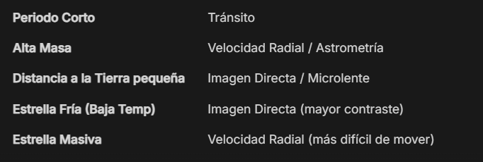

# 🪐 Exoplanetary Data Analysis & Pipeline Cleaning

Applied data science project analyzing astrophysical data from the **Open Exoplanet Catalogue (OEC)**.

## Key Tasks
* **Data Robustness:** Designed data-cleaning pipelines capable of detecting and handling corrupted/missing values (`oec_corrupted.csv`).
* **Feature Selection & Correlation:** Investigated planetary mass, orbital period, and stellar properties to find governing correlations.
* **Visualization:** Multi-variable distribution plots and feature importance rankings.

## Feature Importance Preview

